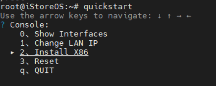

# 1.1.1  直接写入U盘


[官方帮助文档](https://doc.linkease.com/zh/guide/istoreos/install\_x86.html)

参考了[悟空的视屏](https://www.youtube.com/watch?v=PRrXpa\_4xdA)


## 1、准备工作

一个U盘、一个显示器、一个键盘、一台windows电脑

## 2、下载IStoreOS固件

[固件下载](https://fw.koolcenter.com/iStoreOS/x86\_64/)

[固件下载-EFI](https://fw.koolcenter.com/iStoreOS/x86\_64\_efi/)


提示 越前面版本越新，请注意看中间的日期，比如 xxx20221123xx-xxx.img.gz,下载完成之后不需要解压


## 3、做启动盘

### 电脑上用balenaEtcher做USB启动盘

[balenaEtcher下载 ](https://etcher.balena.io/)

### &#x20;电脑插入U盘，打开balenaEtcher工具，选择下载好的固件、选择U盘，把固件写入到U盘

&#x20;

### 把U盘/键盘/显示器接入X86机器，通电开机然后狂按Delete进入BIOS



一般按Delete，x86机器太多，范围太广，可能不一定所有的机器都是Delete快捷启动，具体自行查看主板官网


&#x20;

### 设置通电开机（选做 方法查询官网）

### 设置U盘启动

&#x20;


如果找不到U盘，那么可能你的U盘不兼容，需要换一个U盘重复上述步骤


### 把固件从U盘安装到系统

登录U盘系统，登录成功之后，输入：

```
quickstart
```

选择InstallX86，一直按确定，就行了。具体如下图所示：


<figure><figcaption></figcaption></figure>

重启黑屏的时候拔掉U盘

## 4、启动系统

系统启动后插好网线，输入：

```
quickstart
```

选择 Show Interfaces 查看网线插入到了哪个网口，以及查看当前LAN口的IP

浏览器输入IP回车即可进入后台


一般只插一根网线即可进入后台，两根网线情况下LAN口IP进不去换WAN口IP试试


&#x20;&#x20;

### 官方提示：

#### 默认IPhttp://192.168.100.1

#### 默认密码：password

#### 如果只有一个网口，默认的网口是LAN；如果大于一个网口，默认eth0是WAN口，其它都是LAN

#### 如果要修改LAN口IP，首页有个内网设置，或者命令行用quickstart命令修改

#### 遇到问题[点击](https://doc.linkease.com/zh/guide/istoreos/question.html)，后续出现问题知道如何解决！
