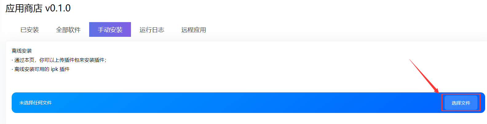

# 2.1.2  科学上网


参考了[悟空的视屏](https://www.youtube.com/watch?v=PRrXpa\_4xdA)


## 1、准备工作

* 正在运行的iStoreOS，没有[请安装](../../1-istoreos-de-an-zhuang/)
* 重要[插件下载](https://github.com/AUK9527/Are-u-ok/tree/main/x86)


PassWall和SSR-Plus安装最后可能会出现一堆ss相关的报错，不要理会，这2个插件位置会出现在<mark style="color:purple;">“VPN”</mark>里

OpenClash在<mark style="color:purple;">**“服务”**</mark>选项里


## 2、上传安装插件

在<mark style="color:purple;">iStore</mark>下选择<mark style="color:purple;">手动安装</mark>，并<mark style="color:purple;">上传</mark>下载好的插件

<figure><figcaption></figcaption></figure>

## 3、更新数据库

### 更新GFW数据库可以使分流更准确

* PassWall在<mark style="color:purple;">“规则管理”</mark>里手动更新，也可开启自动更新
* SSR-Plus在<mark style="color:purple;">“状态”</mark>里手动更新
* OpenClash在<mark style="color:purple;">“插件设置”</mark>下按需配置


Clash作者被请喝茶后不建议使用


## 4、自己按需配置订阅文件

未完待续。。。
